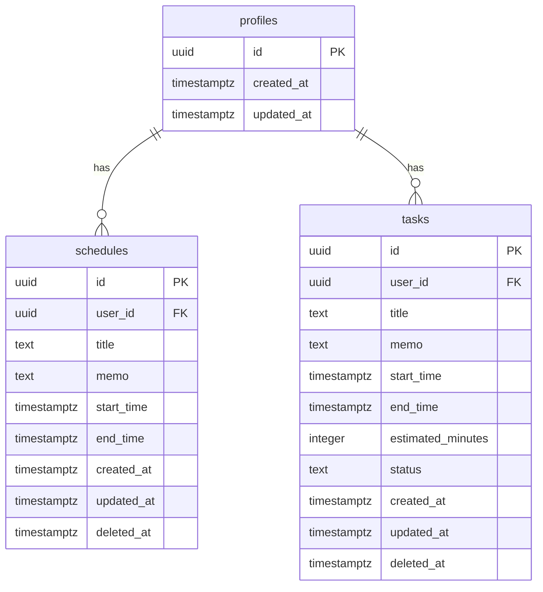

# ER図

## 補足

### 制約

**profiles**
- id: PRIMARY KEY
- created_at: NOT NULL
- updated_at: NULL許容

**schedules**
- id: PRIMARY KEY
- user_id: FOREIGN KEY（profilesを参照、CASCADE DELETE）
- title: NOT NULL
- start_time: NOT NULL
- end_time: NOT NULL
- memo: NULL許容
- created_at: NOT NULL
- updated_at: NULL許容
- deleted_at: NULL許容

**tasks**
- id: PRIMARY KEY
- user_id: FOREIGN KEY（profilesを参照、CASCADE DELETE）
- title: NOT NULL
- start_time: NOT NULL
- end_time: NOT NULL
- estimated_minutes: NOT NULL
- status: NOT NULL、text（INBOX / SCHEDULED / COMPLETED）、デフォルト値はINBOX
- memo: NULL許容
- created_at: NOT NULL
- updated_at: NULL許容
- deleted_at: NULL許容